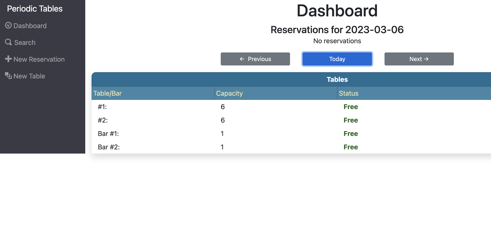
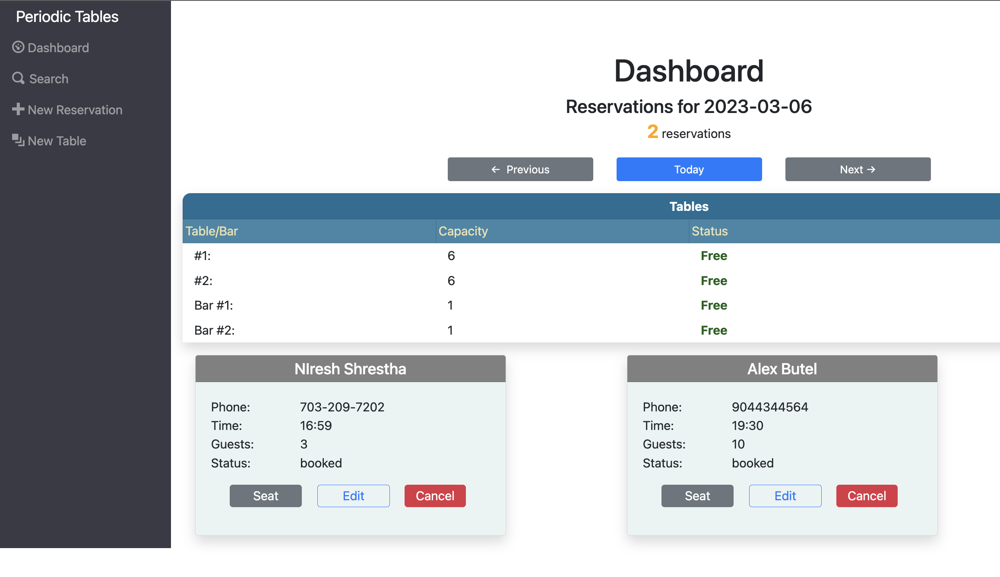
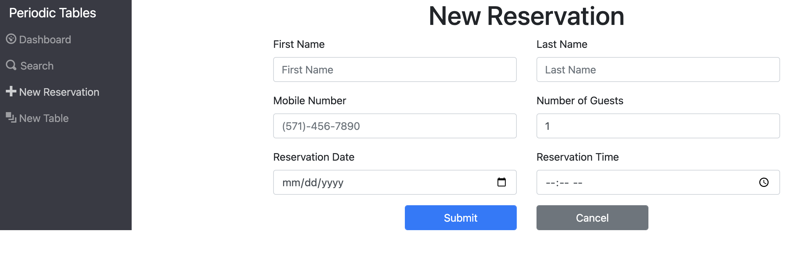
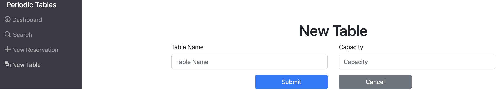
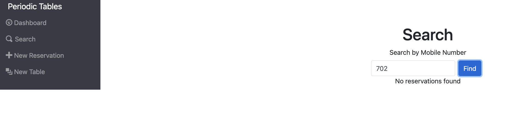
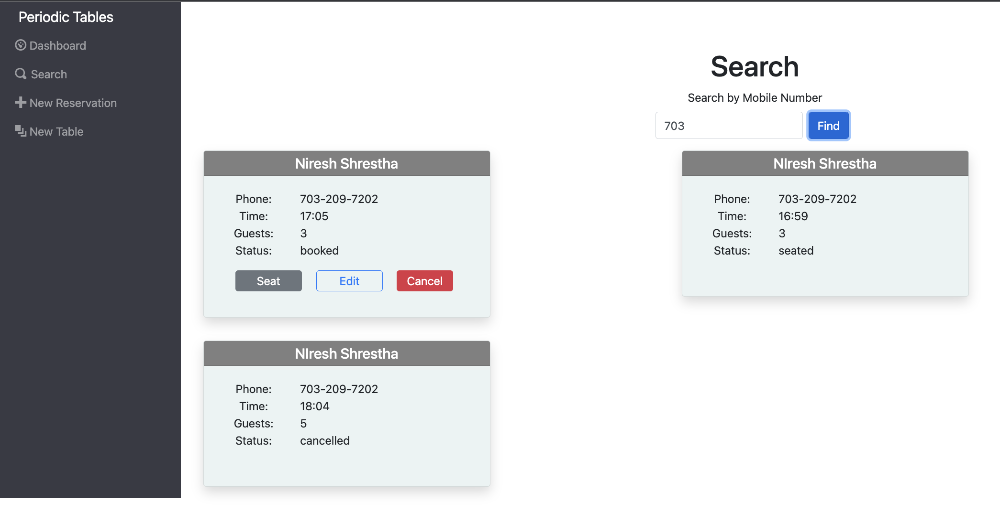

# Restaurant Reservation System - Periodic Table
## Applicaiton link : [Periodic Table Dashboard](https://rss-restaurant-reservation-system-frontend.vercel.app/dashboard)

  
 Table of Content 

  <ol>
    <li> <a href="#about-the-project-and-application">About The Project and Application</a></li>
    <li> <a href="#description">Description</a></li>
    <li> <a href="#dashboard">Dashboard</a></li>
    <li> <a href="#search">Search</a></li>
    <li> <a href="#new-reservation">New Reservation</a></li>
    <li> <a href="#new-table">New Table</a></li>
    <li> <a href="#snippets">Snippets</a></li>
  </ol>

### About the Project and Application

### Description
Restaurant Reservation System is a React based full stack application. This application helps in managing reservations with ability to create, edit, cancel reservations as well as create and fulfill tables. It also has features to search reservation based on mobile phone, which utilizes regex search pattern. 
Application has Four major sections as Dashboard, Search, New Reservation and New Tables.

### Dashboard
* Displays all the reservations for the day, i.e. current date.
* 3 button - Previous, Today and Next which on click toggels to the +1 or -1 day, and displays all the reservation for that day.
* Reservation with status as "booked" and "seated" status are only displayed. 
* Reservation once finished closes the reservation and no longer displayed.
* another section displays the list of tables, with status as Free or Occupied.
* Table when occupied, will shoe "Finish" button, which on click free the table and close the related reservation.

### Search
* This section has Search bar with respect to Mobile Number. 
* Its a regex search so search can be triggerd with eithe full number or partial number. 
* Reservation irrespective of any status are displayed.

### New Reservation
* This is the reservation form for new reservation. 
* First Name, Last Name, reservation date, reseration time, no. of guests and Mobile number are the required fields. 
* Reservation can be on any day except for tuesday. 
* Reservation time is between 10:30 AM to 09:30 PM.
* On submission, we land back to Dashboard page where New reservation resides. 

### New Table
* This is the Table form where we can create Tables, with table name and capacity for that table. 

### Snippets
* Dashboard with No reservations

* Dashboard with reservations

* New Reservation Form

* New Table Form

* Search Resulting No Output

* Search Resulting Output

